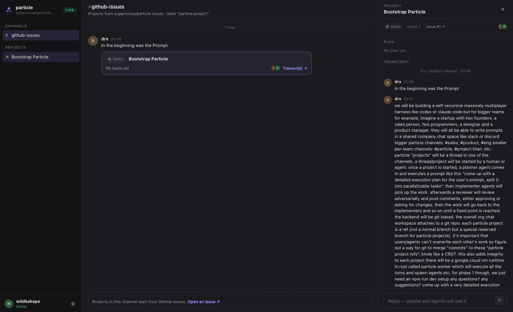

# particle ui

The three-pane workspace for supervising coding agents: channels on the left,
conversation in the middle, project transcripts on the right.



Connects to the local worker (`npm run particle-worker`): one snapshot from
`/api/workspace`, then an SSE tick per appended event batch. Replies post back
into the project's event log as the workspace operator. When the worker is
unreachable (or with `?mock=1`) the UI falls back to a design dataset
(`src/data.ts`) with a scripted implement → review pass — the MOCK/LIVE chip in
the sidebar tells you which world you're looking at. Design rationale in
[DESIGN.md](DESIGN.md).

## Run it

From the repo root:

```
npm install
npm run particle-worker   # serves the API — and the UI itself once built
npm run ui                # dev server on :5173, /api proxied to the worker
```

`npm run build -w @particle/ui` type-checks and bundles; the worker serves the
built app at http://localhost:7455.

## Layout

```
src/
  types.ts        domain model (served by the worker's serializer)
  live.ts         worker connection: snapshot fetch + SSE + posting
  data.ts         the mock dataset and scripted feed (fallback / ?mock=1)
  App.tsx         live/mock containers
  Workspace.tsx   the three-pane shell
  components/     Sidebar, ChannelView, ProjectPane, ProjectCard, …
  styles.css      design tokens (light/dark) and all styling
```

No dependencies beyond React. Theme follows the system, toggleable in the sidebar
footer, `?theme=light|dark` overrides for screenshots.
