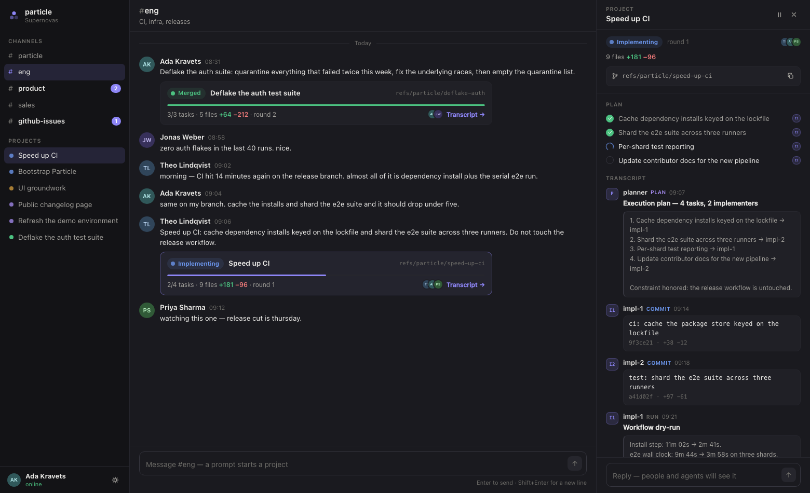

# particle ui

The three-pane workspace for supervising coding agents: channels on the left,
conversation in the middle, project transcripts on the right.



Runs entirely on mock data (`src/data.ts`) — no backend needed. A short scripted
feed plays one implement → review pass after load so the live states are visible.
Design rationale in [DESIGN.md](DESIGN.md).

## Run it

From the repo root:

```
npm install
npm run ui
```

Vite serves on http://localhost:5173. `npm run build -w @particle/ui` type-checks and bundles.

## Layout

```
src/
  types.ts        domain model (the proposed worker contract)
  data.ts         mock org, channels, projects, transcripts, scripted feed
  App.tsx         state + wiring
  components/     Sidebar, ChannelView, ProjectPane, ProjectCard, …
  styles.css      design tokens (light/dark) and all styling
```

No dependencies beyond React. Theme follows the system, toggleable in the sidebar
footer, `?theme=light|dark` overrides for screenshots.
